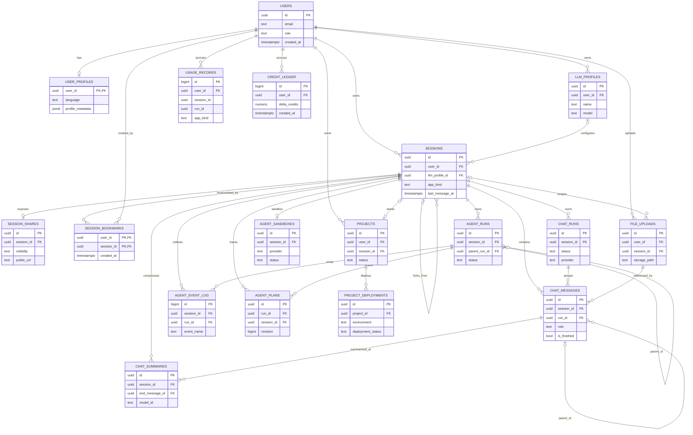
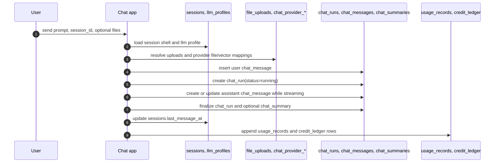
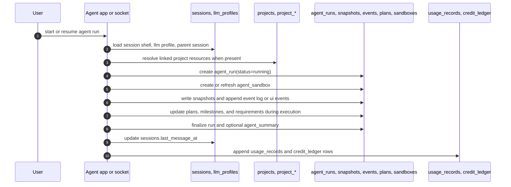

# Platform DB Diagram And Data Flow

Related docs:

- [Platform Target Schema](./platform-target-schema.md)
- [Platform Database Redesign](./platform-database-redesign.md)
- [Chat and Agent DB Ownership Design](./chat-agent-db-ownership.md)
- [Chat and Agent Application Design](./chat-agent-application-design.md)

## Scope

This is a visual companion to the target schema docs.

- It uses the target table names from [Platform Target Schema](./platform-target-schema.md).
- It optimizes for readability, so it shows the main ownership edges and omits some secondary tables and most columns.
- It treats `sessions` as the shared shell and `chat_*` / `agent_*` as separate application-owned persistence.

Current repo naming is still partly transitional:

- `conversation_summaries` becomes `chat_summaries`
- `provider_*` becomes `chat_provider_*`
- `agent_run_tasks` / `agent_run_messages` / `agent_run_events` evolve toward `agent_runs` / `agent_run_snapshots` / `agent_event_log`

## Domain Map

| Domain | Main tables | Purpose |
| --- | --- | --- |
| Identity | `users`, `user_profiles`, `user_api_keys`, `waitlist_entries` | User identity, profile, API access, waitlist |
| Billing and metering | `billing_customers`, `billing_subscriptions`, `billing_events`, `credit_ledger`, `usage_records` | Customer state, webhook/event capture, credits, usage accounting |
| Settings | `llm_provider_credentials`, `llm_profiles`, `mcp_server_configs` | User-configured provider credentials and model profiles |
| Session shell | `sessions`, `session_shares`, `session_bookmarks` | Shared ownership and listing shell for both apps |
| Chat runtime | `chat_runs`, `chat_messages`, `chat_summaries`, `chat_provider_*` | Chat turn lifecycle, visible conversation, provider-side chat resources |
| Agent runtime | `agent_runs`, `agent_run_snapshots`, `agent_event_log`, `agent_ui_events`, `agent_summaries`, `agent_sandboxes`, `agent_plans`, `agent_milestones`, `agent_requirements` | Agent execution state, event history, planning, sandbox lifecycle |
| Files | `file_uploads` | User-uploaded files shared across app flows |
| Projects | `projects`, `project_deployments`, `project_domains`, `project_databases`, `project_secrets`, `project_storage_resources` | Project workspace and deployment resources |
| Content | `presentations`, `presentation_slides`, `presentation_slide_versions`, `slide_templates`, `storybooks`, `storybook_*`, `media_templates` | Generated slides and storybook assets |
| Skills and integrations | `skills`, `integration_connections`, `composio_profiles` | User-installed skills and external integrations |
| Mobile and system | `apple_accounts`, `apple_build_credentials`, `system_configs` | Apple build credentials and platform config |

## Core ER Diagram

This diagram focuses on the operational center of the redesign: identity, settings, sessions, chat, agent, files, projects, and metering.

Notes:

- Omitted for readability: `billing_*`, `llm_provider_credentials`, `mcp_server_configs`, `chat_provider_*`, `agent_run_snapshots`, `agent_ui_events`, `agent_summaries`, `agent_milestones`, `agent_requirements`, content tables, integrations, mobile, and system tables.
- `usage_records.run_id` is intentionally not shown as a hard foreign key edge because the target schema treats it as polymorphic across `chat_runs` and `agent_runs`.
- `projects.current_production_deployment_id` is also omitted from the diagram because it is a follow-up circular foreign key in the DDL sketch.

## Data Flow

The key design rule is: `sessions` is the shared shell, while chat and agent write their own runtime tables.

### Chat Turn Flow

### Agent Run Flow

### Cross-Cutting Rules

- `sessions` should answer ownership, app kind, sharing, and list metadata; it should not carry chat turn state or agent runtime state.
- Chat cancellation and completion should target `chat_runs`, not `agent_runs`.
- Agent execution history should append to `agent_event_log` and related agent-owned tables, not to generic cross-app tables.
- Files, projects, and billing are shared supporting domains; they should be referenced by chat or agent, but not used to collapse the app boundary.
