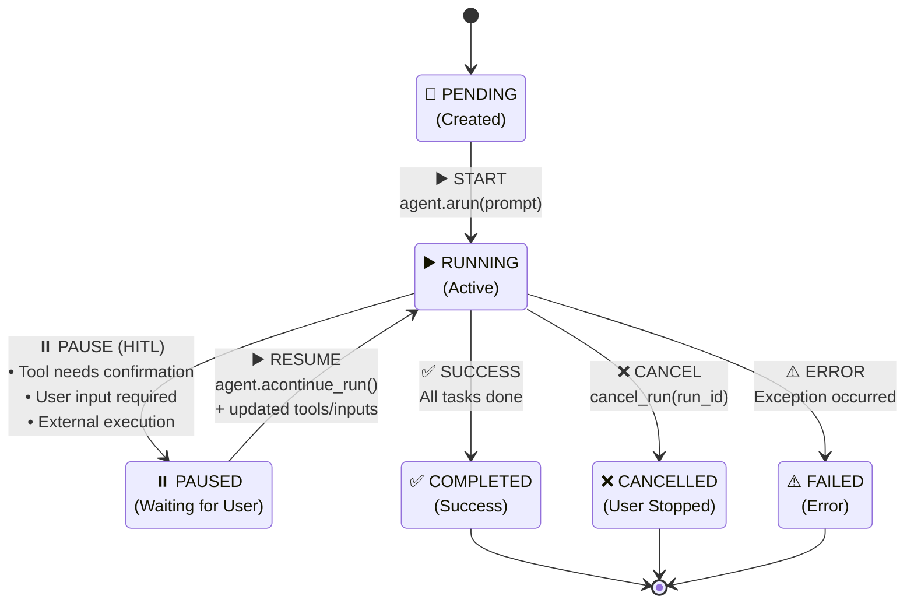
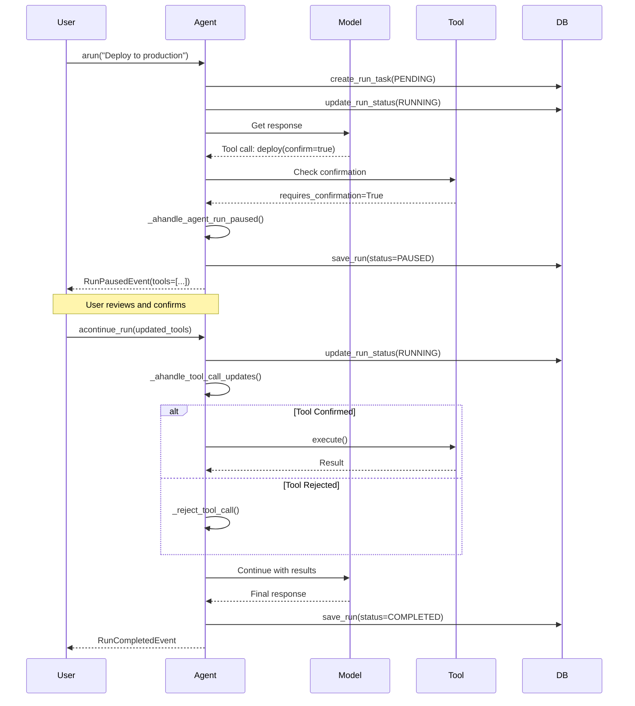

# II-Agent V1 Framework

A comprehensive, async-first Python agent framework for building LLM-powered agents with tool calling, session management, and multi-provider support.

## Table of Contents

- [Project Structure](#project-structure)
- [Quick Start](#quick-start)
- [Agents](#agents)
  - [IIAgent Class](#iiagent-class)
  - [Agent Configuration](#agent-configuration)
  - [Agent Initialization Example](#agent-initialization-example)
- [Tools](#tools)
  - [BaseTool (Class-Based)](#basetool-class-based)
  - [Function-Based Tools (@tool decorator)](#function-based-tools-tool-decorator)
  - [Tool Hooks](#tool-hooks)
- [Models](#models)
  - [Supported Providers](#supported-providers)
  - [Model Configuration](#model-configuration)
  - [Model Initialization Examples](#model-initialization-examples)
- [Advanced Features](#advanced-features)
  - [API Endpoints](#api-endpoints)
  - [Session Management](#session-management)
  - [Agent Hooks](#agent-hooks)
  - [Agent as Tool (Hierarchical Agents)](#agent-as-tool-hierarchical-agents)
  - [Agent Run State Machine](#agent-run-state-machine)

---

## Project Structure

```
src/ii_agent/v1/
├── agents/              # Agent implementations
│   ├── agent.py         # IIAgent - main agent class
│   └── __init__.py
├── tools/               # Tool system
│   ├── base.py          # BaseAgentTool abstract class
│   ├── function.py      # Function and FunctionCall classes
│   ├── decorator.py     # @tool decorator
│   ├── toolkit.py       # Toolkit container class
│   ├── web_search.py    # WebSearchTool implementation
│   ├── web_visit.py     # WebVisitTool implementation
│   ├── image_search.py  # ImageSearchTool implementation
│   ├── image_generate.py# ImageGenerateTool implementation
│   └── web.py           # Function-based web tools + WebToolkit
├── models/              # Model providers
│   ├── base.py          # Abstract Model class
│   ├── message.py       # Message class
│   ├── response.py      # ModelResponse class
│   ├── metrics.py       # Metrics tracking
│   ├── provider.py      # Provider enum
│   ├── anthropic/       # Anthropic Claude implementation
│   ├── openai/          # OpenAI implementation
│   ├── google/          # Google Gemini implementation
│   └── vertexai/        # VertexAI implementation
├── run/                 # Run context and output
├── sessions/            # Session management
├── media/               # Media handling (Image, Video, Audio, File)
├── hooks/               # Hook utilities
├── db/                  # Database stores
├── sandboxes/           # Sandbox environments (E2B)
├── events/              # Event system
├── api/                 # API utilities
├── utils/               # Utility functions
└── exceptions.py        # Custom exceptions
```

---

## Quick Start

```python
import asyncio
from ii_agent.v1.agents import IIAgent
from ii_agent.v1.tools import tool, WebSearchTool
from ii_agent.v1.models.anthropic.claude import Claude

# Define a simple tool
@tool
async def get_weather(city: str) -> str:
    """Get current weather for a city."""
    return f"The weather in {city} is sunny, 25°C"

# Initialize model
model = Claude(
    id="claude-sonnet-4-20250514",
    api_key="your-api-key",  # or set ANTHROPIC_API_KEY env var
    max_tokens=4096
)

# Create agent with tools
agent = IIAgent(
    name="weather-assistant",
    user_id="user-123",
    session_id="session-456",
    model=model,
    tools=[get_weather, WebSearchTool()],
    system_message="You are a helpful weather assistant."
)

# Run the agent
async def main():
    response = await agent.arun("What's the weather in Tokyo?")
    print(response.content)

asyncio.run(main())
```

---

## Agents

### IIAgent Class

The `IIAgent` is the core agent class that orchestrates model interactions, tool execution, and session management.

**Key Attributes:**

| Attribute | Type | Description |
|-----------|------|-------------|
| `user_id` | `str` | Required. User identifier |
| `session_id` | `str` | Required. Session identifier |
| `name` | `Optional[str]` | Agent display name |
| `model` | `Model` | LLM provider instance |
| `tools` | `List[...]` | List of tools (BaseAgentTool, Function, callable, etc.) |
| `system_message` | `str/Callable/Message` | System prompt |
| `stream` | `bool` | Enable response streaming |
| `pre_hooks` | `List[Callable]` | Hooks executed before processing |
| `post_hooks` | `List[Callable]` | Hooks executed after output generation |
| `tool_hooks` | `List[Callable]` | Middleware around tool calls |
| `session_store` | `AgentSessionStore` | Session persistence store |
| `session_state` | `Dict[str, Any]` | Persistent state across runs |
| `retries` | `int` | Retry attempts on failure |
| `tool_call_limit` | `int` | Maximum tool calls per run |

### Agent Configuration

```python
from ii_agent.v1.agents import IIAgent
from ii_agent.v1.models.anthropic.claude import Claude

agent = IIAgent(
    # Required identifiers
    user_id="user-123",
    session_id="session-456",

    # Agent identity
    name="my-assistant",
    description="A helpful AI assistant",

    # Model configuration
    model=Claude(id="claude-sonnet-4-20250514"),

    # Tools
    tools=[my_tool1, my_tool2],
    tool_call_limit=10,
    tool_choice="auto",  # "auto", "none", or specific tool dict

    # System message options
    system_message="You are a helpful assistant.",
    # OR use callable:
    # system_message=lambda session, user_id: f"Assistant for {user_id}",
    # OR legacy style:
    # description="AI assistant",
    # instructions=["Be helpful", "Be concise"],
    # additional_context="User prefers formal language",

    # Streaming
    stream=True,
    stream_events=True,

    # Retry configuration
    retries=3,
    delay_between_retries=2,
    exponential_backoff=True,

    # Session state
    session_state={"user_preference": "dark_mode"},

    # Hooks
    pre_hooks=[setup_hook],
    post_hooks=[cleanup_hook],
    tool_hooks=[logging_middleware],

    # Metadata
    metadata={"version": "1.0", "environment": "production"},
)
```

### Agent Initialization Example

**Basic Agent:**

```python
from ii_agent.v1.agents import IIAgent
from ii_agent.v1.models.anthropic.claude import Claude

# Create model
model = Claude(
    id="claude-sonnet-4-20250514",
    max_tokens=4096,
    temperature=0.7,
)

# Create agent
agent = IIAgent(
    user_id="user-001",
    session_id="session-001",
    name="assistant",
    model=model,
    system_message="You are a helpful AI assistant.",
)

# Run agent
response = await agent.arun("Hello, how are you?")
print(response.content)
```

**Agent with Extended Thinking (Claude):**

```python
model = Claude(
    id="claude-sonnet-4-20250514",
    max_tokens=16000,
    thinking={
        "type": "enabled",
        "budget_tokens": 10000  # Token budget for thinking
    }
)

agent = IIAgent(
    user_id="user-001",
    session_id="session-001",
    model=model,
    tools=[complex_analysis_tool],
)
```

**Streaming Agent:**

```python
agent = IIAgent(
    user_id="user-001",
    session_id="session-001",
    model=model,
    stream=True,
)

# Stream responses
async for event in agent.arun("Explain quantum computing", stream=True):
    if hasattr(event, 'content') and event.content:
        print(event.content, end="", flush=True)
```

---

## Tools

The framework supports two approaches for creating tools: class-based (`BaseAgentTool`) and function-based (`@tool` decorator).

### BaseTool (Class-Based)

Extend `BaseAgentTool` for stateful tools with lifecycle hooks.

> **📚 Comprehensive Examples:** See [tests/v1/tools/test_basetool.py](../../../tests/v1/tools/test_basetool.py) for complete cookbook examples including DatabaseTool, APIClientTool, and DataProcessingTool with full lifecycle hooks.

**BaseAgentTool Attributes:**

| Attribute | Type | Description |
|-----------|------|-------------|
| `name` | `str` | Tool identifier |
| `description` | `str` | LLM-facing tool description |
| `input_schema` | `dict` | JSON Schema for parameters |
| `read_only` | `bool` | Whether tool only reads data |
| `display_name` | `str` | Human-readable name for UI |
| `instructions` | `Optional[str]` | Usage instructions |
| `add_instructions` | `bool` | Add instructions to system prompt |
| `run_in_sandbox` | `bool` | Execute in sandbox environment |

**Methods:**

| Method | Description |
|--------|-------------|
| `async execute(tool_input: dict) -> ToolResult` | Main execution method (required) |
| `async on_tool_start(agent, fc)` | Pre-execution hook |
| `async on_tool_end(agent, fc)` | Post-execution hook |
| `should_confirm_execute(tool_input) -> bool` | Check if confirmation required |

**Example: Custom BaseAgentTool**

```python
from ii_agent.v1.tools import BaseAgentTool, ToolResult

class DatabaseQueryTool(BaseAgentTool):
    """Tool for querying a database."""

    name = "database_query"
    display_name = "Database Query"
    description = "Execute SQL queries against the database"
    input_schema = {
        "type": "object",
        "properties": {
            "query": {
                "type": "string",
                "description": "SQL query to execute"
            },
            "limit": {
                "type": "integer",
                "description": "Maximum number of rows to return",
                "default": 100
            }
        },
        "required": ["query"]
    }
    read_only = True  # Set to False if tool modifies data

    def __init__(self, connection_string: str):
        """Initialize with database connection."""
        self.connection_string = connection_string
        self._connection = None

    async def on_tool_start(self, agent, fc):
        """Called before tool execution - setup connection."""
        from ii_agent.v1.agents import IIAgent
        from ii_agent.v1.tools import FunctionCall

        # fc.arguments contains the tool input
        print(f"Executing query: {fc.arguments.get('query', '')[:50]}...")

        # Initialize connection if needed
        if self._connection is None:
            self._connection = await self._create_connection()

    async def on_tool_end(self, agent, fc):
        """Called after tool execution - log results."""
        if fc.error:
            print(f"Query failed: {fc.error}")
        else:
            print(f"Query completed successfully")

    async def execute(self, tool_input: dict) -> ToolResult:
        """Execute the database query."""
        query = tool_input["query"]
        limit = tool_input.get("limit", 100)

        try:
            # Execute query (simplified example)
            results = await self._execute_query(query, limit)

            return ToolResult(
                llm_content=f"Query returned {len(results)} rows:\n{results}",
                user_display_content={"rows": results, "count": len(results)},
                is_error=False
            )
        except Exception as e:
            return ToolResult(
                llm_content=f"Query failed: {str(e)}",
                is_error=True
            )

    async def _create_connection(self):
        """Create database connection."""
        # Implementation here
        pass

    async def _execute_query(self, query: str, limit: int):
        """Execute query and return results."""
        # Implementation here
        return []

# Usage
tool = DatabaseQueryTool(connection_string="postgresql://...")
agent = IIAgent(
    user_id="user-001",
    session_id="session-001",
    model=model,
    tools=[tool]
)
```

**Example: Tool with Confirmation**

```python
from ii_agent.v1.tools import BaseAgentTool, ToolResult, ToolConfirmationDetails

class FileDeleteTool(BaseAgentTool):
    name = "delete_file"
    description = "Delete a file from the filesystem"
    input_schema = {
        "type": "object",
        "properties": {
            "path": {"type": "string", "description": "Path to file to delete"}
        },
        "required": ["path"]
    }
    read_only = False  # This tool modifies data

    def should_confirm_execute(self, tool_input: dict) -> ToolConfirmationDetails:
        """Require confirmation before deleting files."""
        path = tool_input.get("path", "")
        return ToolConfirmationDetails(
            type="bash",
            message=f"Delete file: {path}?"
        )

    async def execute(self, tool_input: dict) -> ToolResult:
        import os
        path = tool_input["path"]

        try:
            os.remove(path)
            return ToolResult(
                llm_content=f"Successfully deleted: {path}",
                is_error=False
            )
        except Exception as e:
            return ToolResult(
                llm_content=f"Failed to delete {path}: {e}",
                is_error=True
            )
```

### Function-Based Tools (@tool decorator)

For simpler tools, use the `@tool` decorator to convert Python functions into agent tools.

**Decorator Options:**

| Option | Type | Description |
|--------|------|-------------|
| `name` | `str` | Override function name |
| `description` | `str` | Override docstring description |
| `instructions` | `str` | Usage instructions for LLM |
| `add_instructions` | `bool` | Add instructions to system prompt |
| `show_result` | `bool` | Display result to user |
| `stop_after_tool_call` | `bool` | Stop agent after execution |
| `requires_confirmation` | `bool` | Require user confirmation |
| `requires_user_input` | `bool` | Require user input fields |
| `external_execution` | `bool` | Execute outside agent context |
| `pre_hook` | `Callable` | Pre-execution hook |
| `post_hook` | `Callable` | Post-execution hook |
| `tool_hooks` | `List[Callable]` | Middleware hooks |

**Basic Function Tool:**

```python
from ii_agent.v1.tools import tool

@tool
async def calculate_sum(a: int, b: int) -> str:
    """Add two numbers together.

    Args:
        a: First number to add
        b: Second number to add

    Returns:
        The sum of a and b
    """
    return f"The sum of {a} and {b} is {a + b}"

# Use with agent
agent = IIAgent(
    user_id="user-001",
    session_id="session-001",
    model=model,
    tools=[calculate_sum]
)
```

**Function Tool with Custom Configuration:**

```python
@tool(
    name="web_fetch",
    description="Fetch content from a URL",
    instructions="Use this tool to retrieve web page content. Always validate URLs first.",
    add_instructions=True,
    show_result=True,
)
async def fetch_url(url: str, timeout: int = 30) -> str:
    """Fetch content from the specified URL.

    Args:
        url: The URL to fetch
        timeout: Request timeout in seconds
    """
    import httpx
    async with httpx.AsyncClient(timeout=timeout) as client:
        response = await client.get(url)
        return response.text[:5000]  # Limit content size
```

**Function Tool with Injected Parameters:**

Functions can receive special injected parameters that are automatically provided:

| Parameter | Type | Description |
|-----------|------|-------------|
| `agent` | `IIAgent` | Current agent instance |
| `run_context` | `RunContext` | Execution context (run_id, session_id, etc.) |
| `session_state` | `Dict` | Mutable session state |
| `dependencies` | `Any` | Injected dependencies |
| `images` | `Sequence[Image]` | Images from conversation |
| `videos` | `Sequence[Video]` | Videos from conversation |
| `audios` | `Sequence[Audio]` | Audio files from conversation |
| `files` | `Sequence[File]` | Files from conversation |

```python
from ii_agent.v1.tools import tool
from ii_agent.v1.run import RunContext
from typing import Dict, Any

@tool
async def track_user_action(
    action: str,
    session_state: Dict[str, Any],  # Injected automatically
    run_context: RunContext,         # Injected automatically
) -> str:
    """Track a user action in session state.

    Args:
        action: The action to track
    """
    # Access and modify session state
    if "actions" not in session_state:
        session_state["actions"] = []

    session_state["actions"].append({
        "action": action,
        "run_id": run_context.run_id,
        "session_id": run_context.session_id
    })

    return f"Tracked action: {action}"

@tool
async def analyze_images(
    prompt: str,
    images: list,  # Injected: images from conversation
    agent,         # Injected: current agent instance
) -> str:
    """Analyze images with a given prompt.

    Args:
        prompt: Analysis instructions
    """
    if not images:
        return "No images provided"

    # Use agent's model for image analysis
    return f"Analyzed {len(images)} images with prompt: {prompt}"
```

### Tool Hooks

Tool hooks provide middleware functionality for tools. There are three types:

1. **Pre-hook**: Runs before tool execution
2. **Post-hook**: Runs after tool execution (in finally block)
3. **Tool hooks**: Middleware that wraps execution

#### Hook Parameters

Hooks can accept these parameters (detected via reflection):

| Parameter | Description |
|-----------|-------------|
| `agent` | IIAgent instance |
| `run_context` | RunContext instance |
| `session_state` | Mutable state dict |
| `dependencies` | Injected dependencies |
| `fc` / `function_call` | FunctionCall instance |
| `name` / `function_name` | Tool name |
| `function` / `func` | The next function in chain |
| `args` / `arguments` | Tool call arguments |

#### Hooks for BaseAgentTool

Use `on_tool_start` and `on_tool_end` methods:

```python
from ii_agent.v1.tools import BaseAgentTool, ToolResult

class MonitoredTool(BaseAgentTool):
    name = "monitored_tool"
    description = "A tool with monitoring hooks"
    input_schema = {"type": "object", "properties": {}}
    read_only = True

    async def on_tool_start(self, agent, fc):
        """Pre-execution hook.

        Args:
            agent: IIAgent instance executing this tool
            fc: FunctionCall with arguments and metadata
        """
        print(f"[START] Tool: {self.name}")
        print(f"  Arguments: {fc.arguments}")
        print(f"  Call ID: {fc.call_id}")

        # You can access agent properties
        print(f"  Agent: {agent.name}")
        print(f"  Session: {agent.session_id}")

        # Perform setup, logging, validation, etc.
        # NOTE: This hook cannot prevent execution

    async def on_tool_end(self, agent, fc):
        """Post-execution hook (called in finally block).

        Args:
            agent: IIAgent instance
            fc: FunctionCall with result or error
        """
        print(f"[END] Tool: {self.name}")

        if fc.error:
            print(f"  Error: {fc.error}")
            # Log error, send alert, etc.
        else:
            print(f"  Result: {fc.result}")
            # Log success, record metrics, etc.

    async def execute(self, tool_input: dict) -> ToolResult:
        return ToolResult(llm_content="Done", is_error=False)
```

#### Hooks for Callable Functions (pre_hook/post_hook)

Use `pre_hook` and `post_hook` parameters in the `@tool` decorator:

```python
from ii_agent.v1.tools import tool
from ii_agent.v1.run import RunContext
import time

# Define hooks as separate functions
async def logging_pre_hook(
    agent,
    fc,  # FunctionCall instance
    session_state: dict,
):
    """Pre-hook for logging and setup."""
    print(f"[PRE] Executing: {fc.function.name}")
    print(f"  Args: {fc.arguments}")

    # Store start time in session state for duration tracking
    session_state["_tool_start_time"] = time.time()

async def logging_post_hook(
    agent,
    fc,
    session_state: dict,
):
    """Post-hook for logging and cleanup."""
    start_time = session_state.pop("_tool_start_time", None)
    duration = time.time() - start_time if start_time else 0

    print(f"[POST] Completed: {fc.function.name}")
    print(f"  Duration: {duration:.2f}s")

    if fc.error:
        print(f"  Error: {fc.error}")
    else:
        print(f"  Result: {str(fc.result)[:100]}...")

# Apply hooks to tool
@tool(
    pre_hook=logging_pre_hook,
    post_hook=logging_post_hook,
)
async def process_data(data: str) -> str:
    """Process the given data.

    Args:
        data: Data to process
    """
    # Simulate processing
    await asyncio.sleep(0.5)
    return f"Processed: {data.upper()}"
```

#### Hooks for Callable Functions (tool_hooks - Middleware Pattern)

For more advanced use cases, use `tool_hooks` which implements a middleware pattern:

```python
from ii_agent.v1.tools import tool
import time

async def timing_middleware(function, args, **kwargs):
    """Middleware that times tool execution."""
    start = time.time()

    # Call the next function in the chain
    result = await function(**args)

    duration = time.time() - start
    print(f"Tool executed in {duration:.3f}s")

    return result

async def validation_middleware(function, args, name, **kwargs):
    """Middleware that validates arguments."""
    print(f"Validating args for {name}: {args}")

    # You can modify args before passing to next function
    validated_args = {k: v for k, v in args.items() if v is not None}

    # Call the next function
    return await function(**validated_args)

async def error_handling_middleware(function, args, session_state, **kwargs):
    """Middleware that handles errors gracefully."""
    try:
        return await function(**args)
    except Exception as e:
        # Log error to session state
        if "errors" not in session_state:
            session_state["errors"] = []
        session_state["errors"].append(str(e))

        # Re-raise or return error message
        return f"Error occurred: {e}"

# Apply middleware chain (executed in order)
@tool(
    tool_hooks=[
        timing_middleware,        # Outermost - runs first/last
        validation_middleware,    # Middle
        error_handling_middleware # Innermost - runs closest to function
    ]
)
async def risky_operation(value: str) -> str:
    """Perform a risky operation.

    Args:
        value: Value to process
    """
    if value == "fail":
        raise ValueError("Intentional failure")
    return f"Success: {value}"
```

**Complete Middleware Example:**

```python
from ii_agent.v1.tools import tool
from ii_agent.v1.run import RunContext
import logging

logger = logging.getLogger(__name__)

async def audit_middleware(
    function,           # Next function in chain
    args: dict,         # Tool arguments
    name: str,          # Tool name
    agent,              # IIAgent instance
    run_context: RunContext,
    session_state: dict,
):
    """Complete audit middleware with full context."""

    # PRE-EXECUTION
    logger.info(f"[AUDIT] Starting: {name}")
    logger.info(f"  User: {run_context.user_id}")
    logger.info(f"  Session: {run_context.session_id}")
    logger.info(f"  Run: {run_context.run_id}")
    logger.info(f"  Args: {args}")

    # Track in session state
    audit_log = session_state.setdefault("audit_log", [])
    audit_entry = {
        "tool": name,
        "args": args,
        "run_id": run_context.run_id,
        "status": "started"
    }
    audit_log.append(audit_entry)

    try:
        # EXECUTE - call next function in chain
        result = await function(**args)

        # POST-EXECUTION (success)
        audit_entry["status"] = "success"
        audit_entry["result_preview"] = str(result)[:100]
        logger.info(f"[AUDIT] Completed: {name}")

        return result

    except Exception as e:
        # POST-EXECUTION (error)
        audit_entry["status"] = "error"
        audit_entry["error"] = str(e)
        logger.error(f"[AUDIT] Failed: {name} - {e}")
        raise

@tool(tool_hooks=[audit_middleware])
async def sensitive_operation(action: str, target: str) -> str:
    """Perform a sensitive operation that requires auditing.

    Args:
        action: The action to perform
        target: The target of the action
    """
    return f"Executed {action} on {target}"
```

---

## Models

### Supported Providers

| Provider | Class | Module |
|----------|-------|--------|
| Anthropic Claude | `Claude` | `ii_agent.v1.models.anthropic.claude` |
| OpenAI Responses | `OpenAIResponses` | `ii_agent.v1.models.openai.responses` |
| Google Gemini | `Gemini` | `ii_agent.v1.models.google.gemini` |
| VertexAI Claude | `Claude` | `ii_agent.v1.models.vertexai.claude` |

### Model Configuration

**Common Configuration Options:**

| Option | Type | Description |
|--------|------|-------------|
| `id` | `str` | Model identifier |
| `temperature` | `float` | Sampling temperature (0-1) |
| `max_tokens` | `int` | Maximum output tokens |
| `top_p` | `float` | Nucleus sampling parameter |
| `retries` | `int` | Retry attempts on failure |
| `delay_between_retries` | `int` | Delay between retries (seconds) |
| `exponential_backoff` | `bool` | Use exponential backoff |

**Provider-Specific Options:**

**Anthropic Claude:**
- `thinking`: Extended thinking configuration
- `cache_system_prompt`: Enable prompt caching
- `betas`: Beta features to enable
- `mcp_servers`: MCP server configurations

**OpenAI:**
- `reasoning_effort`: Reasoning level (low/medium/high)
- `max_completion_tokens`: Completion token limit
- `strict_output`: Strict JSON output mode

### Model Initialization Examples

**Anthropic Claude:**

```python
from ii_agent.v1.models.anthropic.claude import Claude

# Basic initialization
model = Claude(
    id="claude-sonnet-4-20250514",
    api_key="your-api-key",  # or use ANTHROPIC_API_KEY env var
    max_tokens=4096,
    temperature=0.7,
)

# With extended thinking
model = Claude(
    id="claude-sonnet-4-20250514",
    max_tokens=16000,
    thinking={
        "type": "enabled",
        "budget_tokens": 10000
    }
)

# With prompt caching
model = Claude(
    id="claude-sonnet-4-20250514",
    max_tokens=4096,
    cache_system_prompt=True,
    extended_cache_time=True,
)

# With retry configuration
model = Claude(
    id="claude-sonnet-4-20250514",
    retries=3,
    delay_between_retries=2,
    exponential_backoff=True,
)
```

**OpenAI Responses:**

```python
from ii_agent.v1.models.openai.responses import OpenAIResponses

# Basic initialization
model = OpenAIResponses(
    id="gpt-4o",
    api_key="your-api-key",  # or use OPENAI_API_KEY env var
    max_tokens=4096,
    temperature=0.7,
)

# With reasoning
model = OpenAIResponses(
    id="o1-preview",
    reasoning_effort="high",
    max_completion_tokens=8000,
)
```

**Google Gemini:**

```python
from ii_agent.v1.models.google.gemini import Gemini

model = Gemini(
    id="gemini-2.0-flash",
    api_key="your-api-key",  # or use GOOGLE_API_KEY env var
    temperature=0.7,
)
```

**VertexAI Claude:**

```python
from ii_agent.v1.models.vertexai.claude import Claude

model = Claude(
    id="claude-sonnet-4@20250514",
    project_id="your-gcp-project",
    region="us-east5",
)
```

---

## Advanced Features

### API Endpoints

The framework includes a FastAPI-based HTTP API for remote agent interactions.

> **📚 API Implementation:** See [src/ii_agent/v1/api/router.py](./api/router.py) for complete API endpoint definitions and request/response schemas.

**Example: Chat with Agent via API**

```bash
curl -X POST http://localhost:8000/v2/agent/test/agent/general \
  -H "Content-Type: application/json" \
  -d '{
    "stream": true,
    "message": "can you try to give me the tesla stock report in md file, that i can download",
    "model_id": "vertex/claude-sonnet-4-5@20250929",
    "session_id": "033a2e5d-6bc7-4ea3-976d-3fe7faef536d",
    "source": "system",
    "tool_args": {}
}'
```

**Request Parameters:**

| Parameter | Type | Description |
|-----------|------|-------------|
| `message` | `string` | User message/prompt |
| `model_id` | `string` | Model identifier (e.g., `vertex/claude-sonnet-4-5@20250929`) |
| `session_id` | `string` | Session identifier for conversation continuity |
| `stream` | `boolean` | Enable streaming response |
| `source` | `string` | Message source (e.g., `"system"`, `"user"`) |
| `tool_args` | `object` | Additional tool configuration |

**Response:**

For streaming (`stream: true`), the API returns Server-Sent Events (SSE):
```
event: RunStarted
data: {"created_at": 1766464530, "event": "RunStarted", "agent_id": "general-agent", "agent_name": "general_agent", "run_id": "69c2bd9c-d3d4-4ec4-bfcc-06054621d41c", "session_id": "033a2e5d-6bc7-4ea3-976d-3fe7faef536d", "model": "claude-sonnet-4-5@20250929", "model_provider": "VertexAI"}

event: ReasoningDelta
data: {"created_at": 1766464533, "event": "ReasoningDelta", "agent_id": "general-agent", "agent_name": "general_agent", "run_id": "69c2bd9c-d3d4-4ec4-bfcc-06054621d41c", "session_id": "033a2e5d-6bc7-4ea3-976d-3fe7faef536d", "reasoning_content": " markdown report", "is_redacted": false}

event: ReasoningDelta
data: {"created_at": 1766464533, "event": "ReasoningDelta", "agent_id": "general-agent", "agent_name": "general_agent", "run_id": "69c2bd9c-d3d4-4ec4-bfcc-06054621d41c", "session_id": "033a2e5d-6bc7-4ea3-976d-3fe7faef536d", "reasoning_content": "\n4. Save it as a file", "is_redacted": false}

event: ReasoningDelta
data: {"created_at": 1766464533, "event": "ReasoningDelta", "agent_id": "general-agent", "agent_name": "general_agent", "run_id": "69c2bd9c-d3d4-4ec4-bfcc-06054621d41c", "session_id": "033a2e5d-6bc7-4ea3-976d-3fe7faef536d", "reasoning_content": " to", "is_redacted": false}

event: RunIntermediateContent
data: {"created_at": 1766464537, "event": "RunIntermediateContent", "agent_id": "", "agent_name": "", "content": "", "content_type": "str"}

event: ToolCallStarted
data: {"created_at": 1766464537, "event": "ToolCallStarted", "agent_id": "general-agent", "agent_name": "general_agent", "run_id": "69c2bd9c-d3d4-4ec4-bfcc-06054621d41c", "session_id": "033a2e5d-6bc7-4ea3-976d-3fe7faef536d", "tool": {"tool_call_id": "toolu_vrtx_01UGhi9U7y4d6DndypMxkxLe", "tool_name": "message_user", "tool_args": {"message": "I'll create a Tesla stock report for you in markdown format that you can download.", "type": "info"}, "tool_call_error": null, "result": null, "metrics": null, "stop_after_tool_call": false, "created_at": 1766464537, "requires_confirmation": null, "confirmed": null, "confirmation_note": null, "requires_user_input": null, "user_input_schema": null, "answered": null, "external_execution_required": null}}
...
```

For non-streaming, returns a JSON response with the agent's output.

### Session Management

The framework uses an abstract `SessionStore` interface for session persistence, allowing different storage backends while maintaining a consistent API.

**Architecture:**
- `SessionStore` - Abstract base class defining the storage interface
- `AgentSessionStore` - Concrete implementation using PostgreSQL/SQLAlchemy
- Custom implementations can be created for JSON files, Redis, DynamoDB, etc.

**SessionStore Interface Methods:**

| Method | Description |
|--------|-------------|
| `create_run_task()` | Create run task at start of execution |
| `update_run_status()` | Update run status with optimistic locking |
| `save_run()` | Persist run messages atomically |
| `get_history_messages()` | Retrieve conversation history for LLM |
| `get_session()` | Read session metadata |
| `delete_session()` | Delete session and messages |

**Basic Usage:**

```python
from ii_agent.v1.agents import IIAgent
from ii_agent.v1.sessions import AgentSessionStore

# Create session store (concrete implementation)
# Note: AgentSessionStore requires a SQLAlchemy session_maker
from sqlalchemy.ext.asyncio import create_async_engine, async_sessionmaker

engine = create_async_engine("postgresql+asyncpg://...")
session_maker = async_sessionmaker(engine, expire_on_commit=False)
store = AgentSessionStore(session_maker=session_maker)

# Agent with persistence
agent = IIAgent(
    user_id="user-001",
    session_id="session-001",
    model=model,
    session_store=store,  # Type: SessionStore (accepts any implementation)
    session_state={"preferences": {"theme": "dark"}}
)

# Session state persists across runs
response1 = await agent.arun("Remember my name is Alice")
response2 = await agent.arun("What's my name?")  # Agent remembers "Alice"
```

**Creating Custom Session Store:**

```python
from ii_agent.v1.sessions import SessionStore
from ii_agent.db.agent import AgentRunTask, RunStatus
from ii_agent.v1.run.agent import RunOutput
from ii_agent.v1.sessions.agent import AgentSession
from typing import List, Optional
import json
import aiofiles
from pathlib import Path

class JsonSessionStore(SessionStore):
    """Custom session store using JSON files."""

    def __init__(self, storage_dir: str = "./sessions"):
        self.storage_dir = Path(storage_dir)
        self.storage_dir.mkdir(exist_ok=True)

    def _get_session_path(self, session_id: str) -> Path:
        return self.storage_dir / f"{session_id}.json"

    async def create_run_task(
        self,
        *,
        session_id: str,
        run_id: str,
        user_message_id: Optional[str] = None,
        status: RunStatus = RunStatus.RUNNING,
    ) -> AgentRunTask:
        # Create run task and save to JSON
        task = AgentRunTask(
            id=run_id,
            session_id=session_id,
            user_message_id=user_message_id,
            status=status.value,
        )
        # Save to file
        return task

    async def save_run(self, run: RunOutput) -> None:
        # Save run to JSON file
        path = self._get_session_path(run.session_id)
        async with aiofiles.open(path, mode='w') as f:
            await f.write(json.dumps(run.to_dict(), indent=2))

    async def get_history_messages(
        self,
        session_id: str,
        *,
        last_n_runs: Optional[int] = None,
        skip_parent_runs: bool = True,
        skip_statuses: Optional[List[RunStatus]] = None,
        skip_roles: Optional[List[str]] = None,
        skip_history_messages: bool = True,
    ) -> List[Message]:
        # Load from JSON and return messages
        path = self._get_session_path(session_id)
        if not path.exists():
            return []

        async with aiofiles.open(path, mode='r') as f:
            content = await f.read()
            data = json.loads(content)
            # Parse and return messages
            return []

    # ... implement other abstract methods

# Use custom store
json_store = JsonSessionStore(storage_dir="./my_sessions")
agent = IIAgent(
    user_id="user-001",
    session_id="session-001",
    model=model,
    session_store=json_store,  # Works with any SessionStore implementation
)
```

### Agent Hooks

```python
async def setup_hook(agent, session, run_input, **kwargs):
    """Pre-processing hook."""
    print(f"Starting run with input: {run_input}")
    # Can modify run_input
    return run_input

async def cleanup_hook(agent, session, run_output, **kwargs):
    """Post-processing hook."""
    print(f"Run completed: {run_output.content[:50]}...")
    # Can modify run_output

agent = IIAgent(
    user_id="user-001",
    session_id="session-001",
    model=model,
    pre_hooks=[setup_hook],
    post_hooks=[cleanup_hook],
)
```

### Agent as Tool (Hierarchical Agents)

```python
# Create a specialized sub-agent
research_agent = IIAgent(
    user_id="user-001",
    session_id="research-session",
    name="research-assistant",
    description="Researches topics using web search",
    model=model,
    tools=[WebSearchTool(), WebVisitTool()],
)

# Convert to tool for parent agent
research_tool = research_agent.as_tool(
    name="research",
    description="Research a topic thoroughly using web search"
)

# Parent agent can use sub-agent as a tool
parent_agent = IIAgent(
    user_id="user-001",
    session_id="main-session",
    model=model,
    tools=[research_tool, other_tools...],
)
```

### Agent Run State Machine

The agent run lifecycle follows a state machine pattern for robust execution and human-in-the-loop (HITL) support:



**Visual Flow:**

```
                    ┌─────────────────┐
                    │  User Request   │
                    └────────┬────────┘
                             ↓
                    ┌────────────────────────────┐
                    │  📝 PENDING                │
                    │  Run task created in DB    │
                    └────────┬───────────────────┘
                             ↓
                    agent.arun("Deploy app")
                             ↓
    ┌────────────────────────────────────────────────────────┐
    │  ▶️ RUNNING - Agent is actively processing             │
    │  • Model generates response                             │
    │  • Tools execute automatically                          │
    │  • Pre/post hooks run                                   │
    └────────┬───────────────────────────┬───────────────────┘
             │                           │
             │ Tool needs approval       │ All done
             ↓                           ↓
    ┌──────────────────────┐    ┌────────────────┐
    │  ⏸️ PAUSED (HITL)    │    │  ✅ COMPLETED  │
    │  Waiting for:        │    │  Success!      │
    │  • Confirmation      │    └────────────────┘
    │  • User input        │             ↓
    │  • External result   │           [END]
    └──────────┬───────────┘
               │
        User reviews & confirms
               │
               ↓
    agent.acontinue_run(updated_tools)
               │
               ↓
    ┌──────────────────────┐
    │  ▶️ RUNNING (resumed)│
    │  Process continues   │
    └──────────┬───────────┘
               │
               ↓
    ┌──────────────────────┐
    │  ✅ COMPLETED        │
    └──────────────────────┘
```

**State Descriptions:**

| State | Description | Next States |
|-------|-------------|-------------|
| `PENDING` | Run task created, waiting to start | `RUNNING` |
| `RUNNING` | Agent actively processing | `PAUSED`, `COMPLETED`, `CANCELLED`, `FAILED` |
| `PAUSED` | Waiting for human input/confirmation | `RUNNING` |
| `COMPLETED` | Run finished successfully | Terminal |
| `CANCELLED` | User cancelled the run | Terminal |
| `FAILED` | Run failed with error | Terminal |

**State Transitions:**

1. **PENDING → RUNNING**:
   - Triggered by: `agent.arun()` or `agent.acontinue_run()`
   - Database: `create_run_task()` then `update_run_status(RUNNING)`

2. **RUNNING → PAUSED**:
   - Triggered by: Tool with `requires_confirmation=True`, `requires_user_input=True`, or `external_execution_required=True`
   - Method: `_ahandle_agent_run_paused()` or `_ahandle_agent_run_paused_stream()`
   - Database: `save_run()` persists PAUSED status
   - Event: `RunPausedEvent` emitted with tools/requirements

3. **PAUSED → RUNNING**:
   - Triggered by: `agent.acontinue_run(run_response=paused_run, updated_tools=[...])`
   - Method: `_acontinue_run()` or `_acontinue_run_stream()`
   - Database: Status set to RUNNING before model call
   - Processing: `_ahandle_tool_call_updates()` processes confirmations/inputs

4. **RUNNING → COMPLETED**:
   - Triggered by: Successful completion (no more tool calls needed)
   - Database: `save_run()` with COMPLETED status
   - Event: `RunCompletedEvent` emitted

5. **RUNNING → CANCELLED**:
   - Triggered by: User cancellation via `cancel_run(run_id)`
   - Database: `update_run_status(CANCELLED)`
   - Event: `RunCancelledEvent` emitted

6. **RUNNING → FAILED**:
   - Triggered by: Unhandled exception during run
   - Database: `save_run()` with FAILED status
   - Event: `RunErrorEvent` emitted

**Human-in-the-Loop (HITL) Flow:**



**Database Persistence:**

The agent state is persisted at key points via the `SessionStore`:

```python
# 1. Run creation (PENDING)
await session_store.create_run_task(
    session_id=session_id,
    run_id=run_id,
    status=RunStatus.PENDING
)

# 2. Run start (RUNNING)
await session_store.update_run_status(
    run_id=run_id,
    status=RunStatus.RUNNING
)

# 3. Pause for HITL (PAUSED)
run_response.status = RunStatus.paused
await session_store.save_run(run=run_response)
# Persists: status, messages, tools, requirements

# 4. Resume from pause (RUNNING)
run_response.status = RunStatus.running
# Continue execution with updated tools

# 5. Completion (COMPLETED/FAILED/CANCELLED)
run_response.status = RunStatus.completed
await session_store.save_run(run=run_response)
```

**HITL Tool Confirmation Example:**

```python
from ii_agent.v1.tools import tool

@tool(requires_confirmation=True)
async def delete_database(database_name: str) -> str:
    """Delete a database. Requires user confirmation.

    Args:
        database_name: Name of database to delete
    """
    # This will pause the run and wait for confirmation
    return f"Deleted database: {database_name}"

# Run agent
run_output = await agent.arun("Clean up old databases", stream_events=True)

# Agent pauses with status=PAUSED
assert run_output.status == RunStatus.paused

# User reviews and confirms
for tool in run_output.tools:
    if tool.requires_confirmation:
        tool.confirmed = True  # or False to reject

# Continue the run
final_output = await agent.acontinue_run(
    run_response=run_output,
    stream=True,
    stream_events=True
)

# Agent resumes with status=RUNNING, then COMPLETED
assert final_output.status == RunStatus.completed
```
